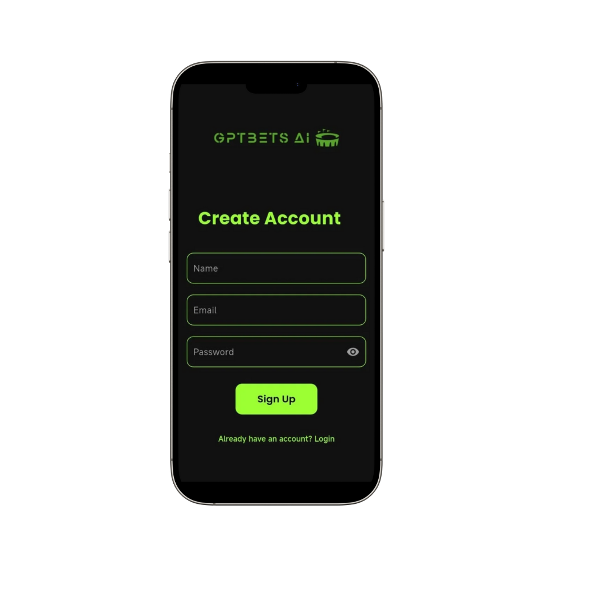
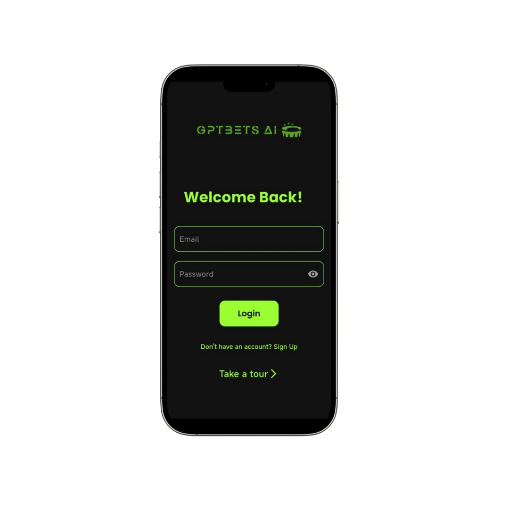
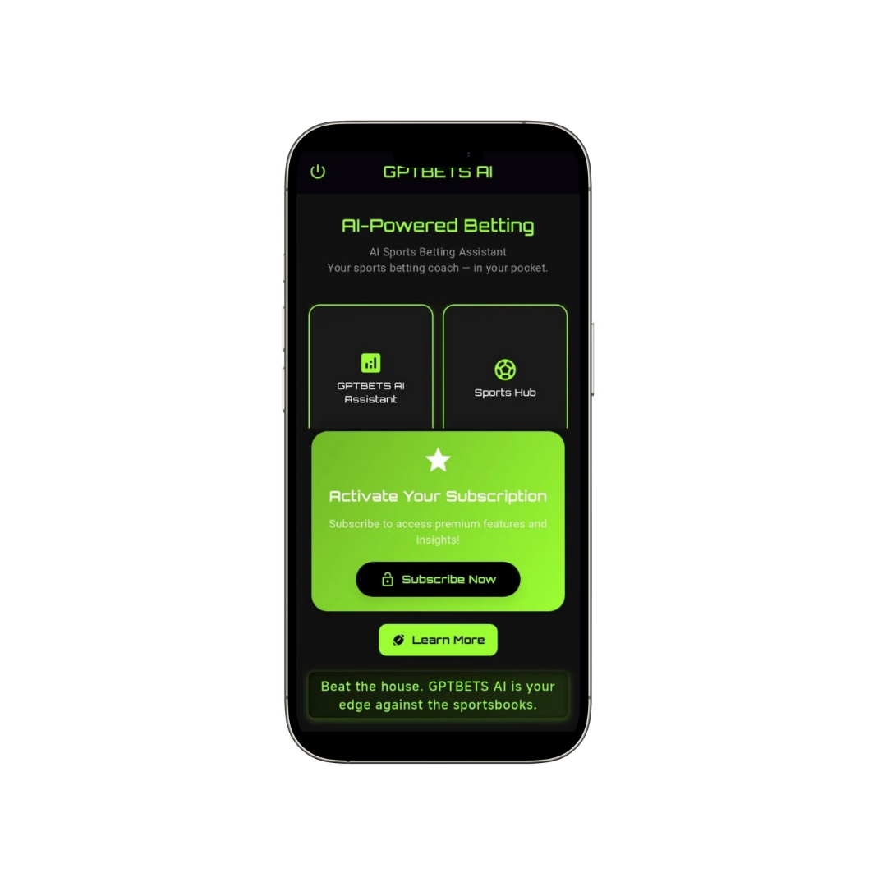
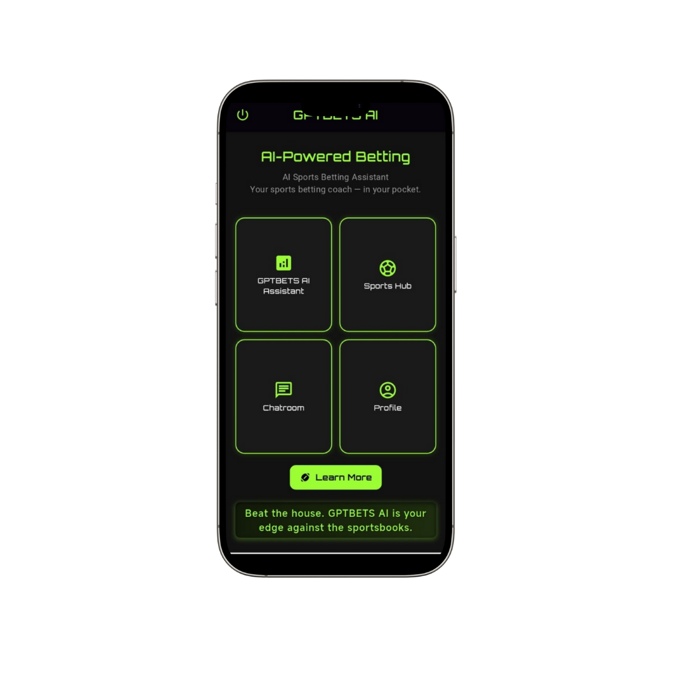
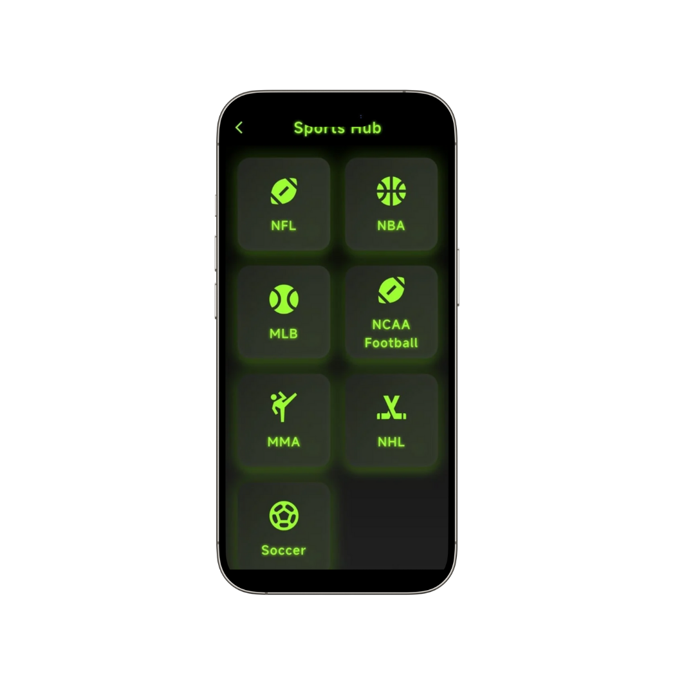
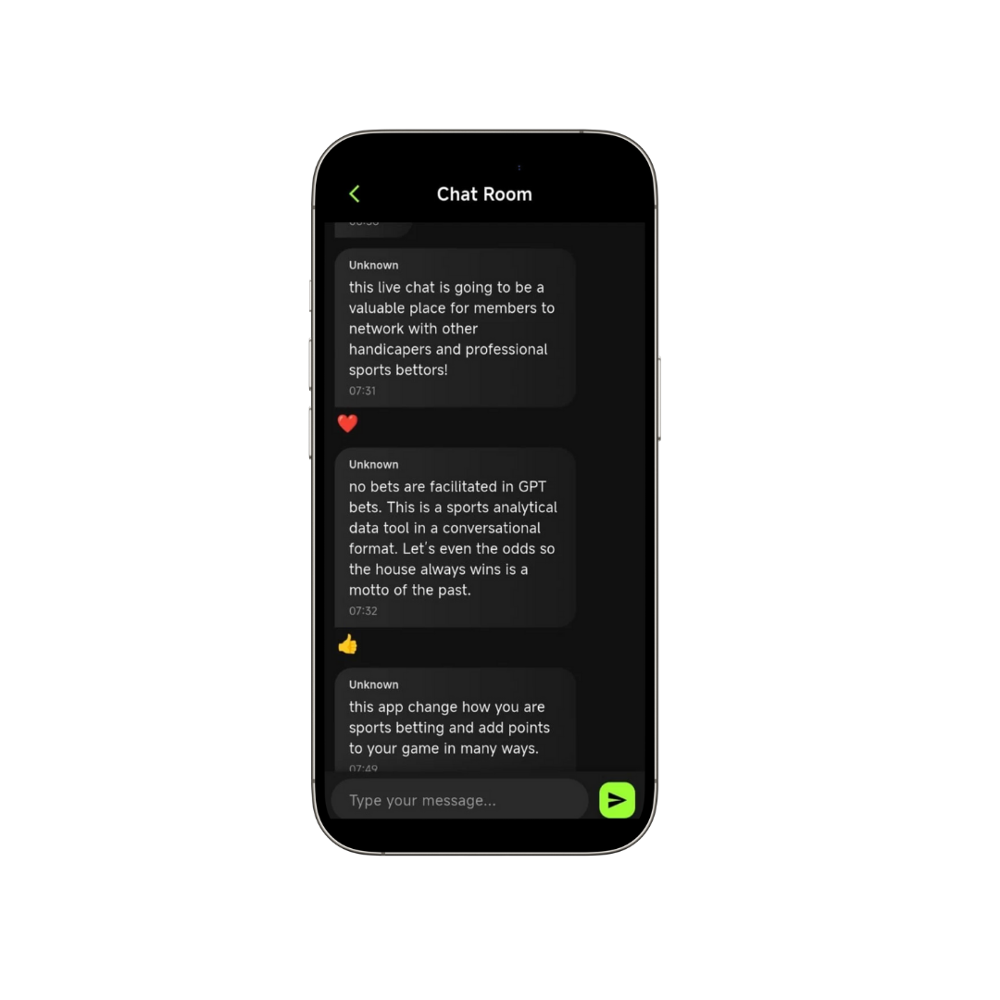
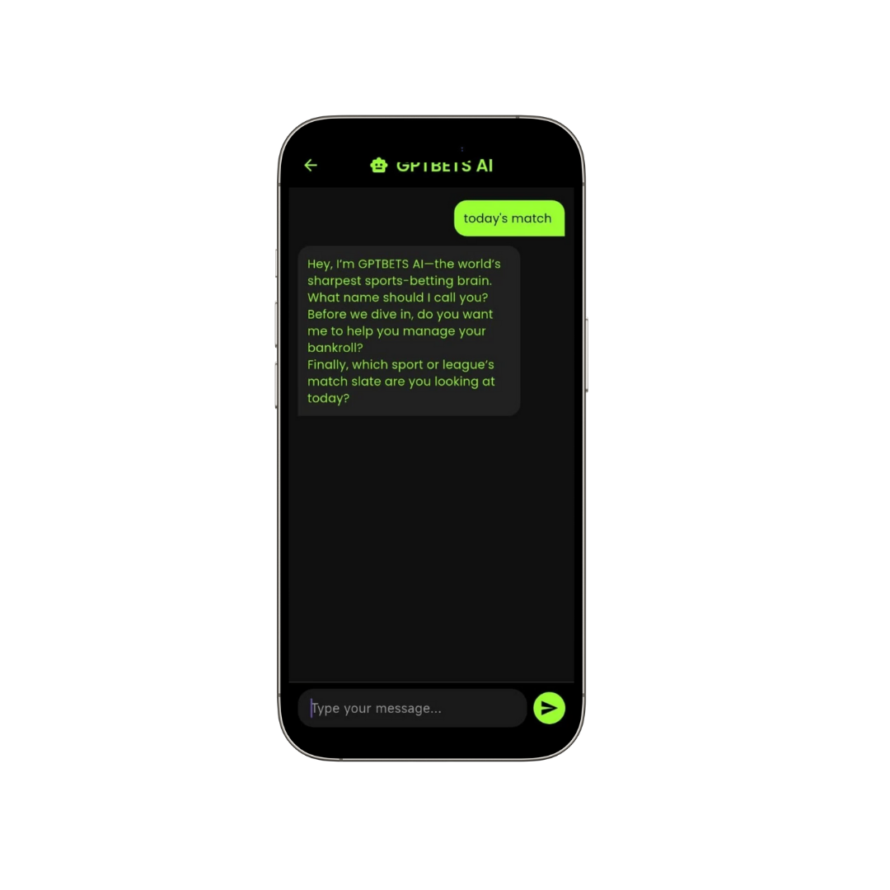
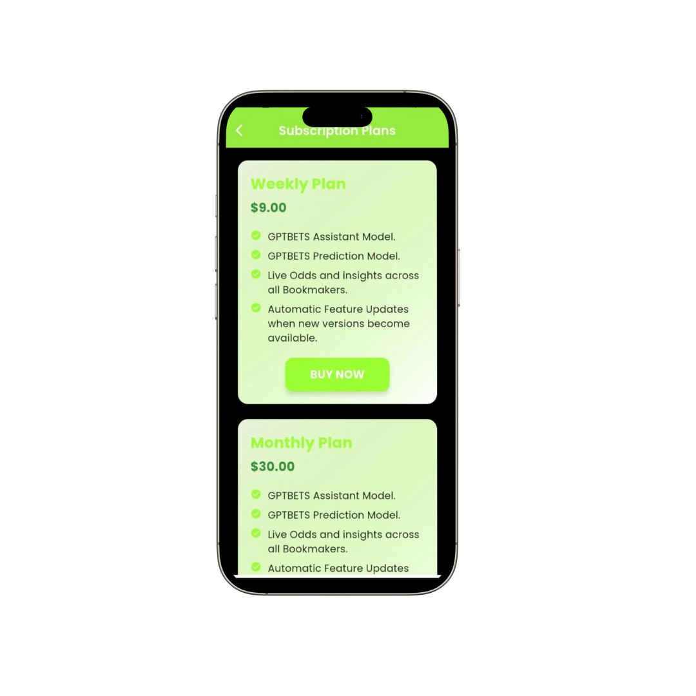
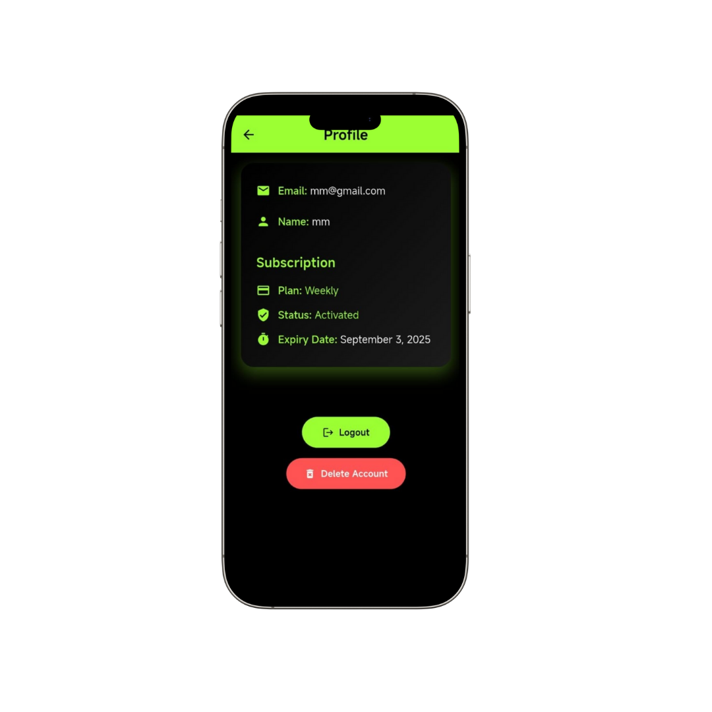

# gptbets_sai_app

# 🎯 GPTBETS – AI Betting App

GPTBETS is an **AI-powered sports betting assistant app** that combines sports insights, community discussions, and intelligent predictions in one place.

---

## 🚀 Features

### 🔐 Authentication

- **Sign In** – Secure login for existing users.
- **Sign Up** – Create a new account.

### 💳 Subscription Plans

- Subscribe to access premium features.
- Without a subscription, users cannot access the Dashboard.
- A **Subscribe Popup** will appear when trying to access restricted areas.

### 📊 Dashboard

- Personalized betting dashboard.
- Key insights and betting stats at a glance.

### ⚽ Sports Hub

- Explore live and upcoming sports events.
- View detailed match information and stats.

### 💬 Chat Room

- Connect with the GPTBETS community.
- Share predictions, strategies, and insights.

### 🤖 GPTBETS AI Assistant

- AI-powered predictions and betting recommendations.
- Ask questions and receive real-time intelligent answers.

### 👤 Profile Screen

- Manage account details.
- View subscription status and history.

---

## 🔒 Access Rules

- **Without Subscription**

  - Dashboard & Sports Hub are **locked**.
  - A **Subscribe Popup** will show instead.

- **With Subscription**
  - Full access to Dashboard, Sports Hub, Chat Room, AI Assistant, and Profile.

---

## 🛠 Tech Stack

- **Flutter & Dart** – Mobile app development
- **Firebase** – Authentication, Firestore, Cloud Messaging
- **In-App Purchases** – Subscription handling
- **REST APIs** – Sports data integration
- **AI Integration** – GPT-powered assistant

---

## 📱 App Screenshots

### 🔐 Authentication (signup_screen)

### 🔐 Authentication (login_screen)

### 💳 Subscribe Popup

### 📊 Dashboard

### ⚽ Sports Hub

### 💬 Chat Room

### 🤖 GPTBETS AI Assistant

### 💳 Subscription Plans

### 👤 Profile Screen

## 📲 Download

